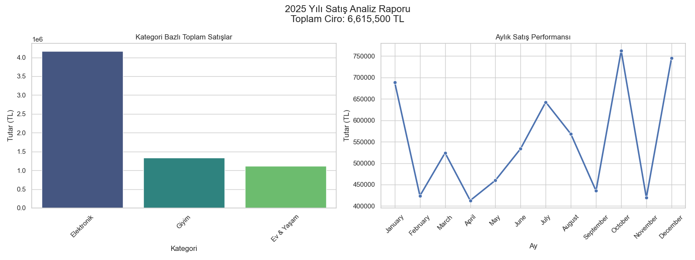

# 📊 E-Commerce Data Analysis & Reporting Tool

A Python-based data analysis tool that generates synthetic e-commerce sales data, performs exploratory data analysis (EDA), and exports visual reports.



## 🚀 Project Overview

This project simulates a real-world data analysis workflow:
1.  **Data Generation:** Creates a realistic dataset of 1000+ sales records (Products, Dates, Prices, Categories).
2.  **Data Cleaning & Processing:** Uses **Pandas** to clean and structure the data.
3.  **Analysis:** Calculates key metrics like Total Revenue, Best Selling Categories, and Monthly Trends.
4.  **Visualization:** Generates professional charts using **Seaborn** and **Matplotlib**.

## 🛠 Tech Stack

* **Language:** Python 3.x
* **Data Manipulation:** Pandas
* **Visualization:** Matplotlib, Seaborn
* **Excel Operations:** OpenPyxl

## ⚙️ How to Run

1.  **Install Requirements**
    ```bash
    pip install pandas matplotlib seaborn openpyxl
    ```

2.  **Generate Data** (Creates `satis_verileri.xlsx`)
    ```bash
    python generate_data.py
    ```

3.  **Run Analysis** (Generates Report & Charts)
    ```bash
    python analyze_data.py
    ```

## 📈 Sample Insights

* **KPI Tracking:** Automatically calculates total revenue and top performers.
* **Trend Analysis:** Visualizes monthly sales performance to identify seasonality.

---
**Author:** Yasin | Data Analyst & Developer